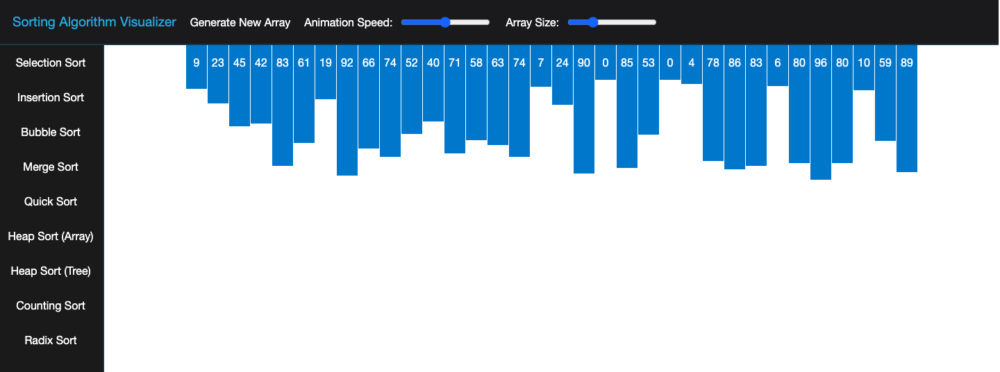

# Sorting Algorithm Visualizer

---

### Table of Contents

- [Description](#description)
- [How to Use](#how-to-use)
- [Demo](#demo)

---

## Description

A collection of animations showing how various sorting algorithms work. The algorithms included are:

- Selection Sort
- Insertion Sort
- Bubble Sort
- Merge Sort
- Quick Sort
- Heap Sort
- Counting Sort
- Radix Sort

#### Technologies Used

- HTML/CSS
- JavaScript
- jQuery

---

## How to Use

1. Select an animation speed and a data set size in the header
2. Choose an algorithm from the sidebar to begin the animation
3. Generate a new data set to reset the animation and choose another algorithm

---

## Demo

A live demo can be found [here](http://zachary-goshen-sorting-algorithm-visualization.s3-website-us-east-1.amazonaws.com).

*This project was developed using chrome and firefox. Other browsers have not been tested and might not work as intended.*
